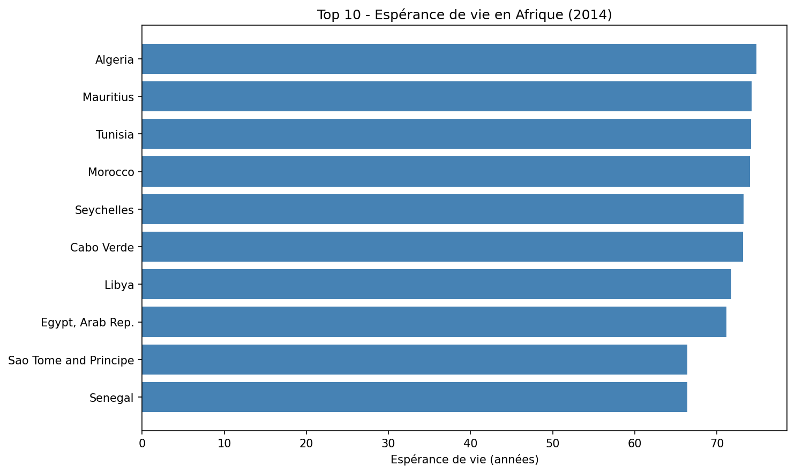
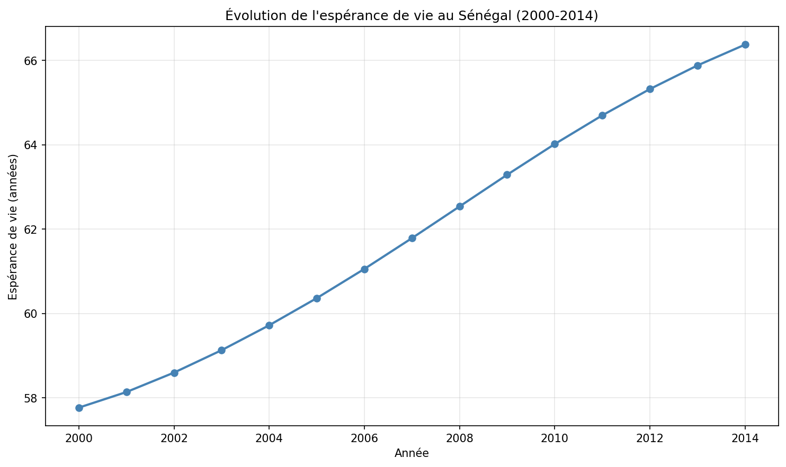

# Health Indicators ETL Pipeline — Africa

End-to-end ETL pipeline that extracts, transforms, loads and analyzes World Bank
health data across 54 African countries, with a focus on Senegal.

## Overview

This project builds a complete data pipeline from a raw World Bank dataset to
SQL-queryable health indicators and visualizations. It covers the four ETL stages
and demonstrates data cleaning, reshaping, storage in a relational database, and
analysis with SQL.

## Pipeline

- **Extract** — Dataset downloaded programmatically from Kaggle via the Kaggle API
  (World Bank Health Nutrition and Population Statistics).
- **Transform** — Cleaning and restructuring with Pandas: column normalization,
  wide-to-long reshaping (`melt`), type conversion, removal of empty records, and
  filtering to the 54 African countries.
- **Load** — Storage in a SQLite database (`sante_afrique.db`).
- **Analyze** — SQL queries and visualizations with Matplotlib.

## Selected Indicators

The analysis focuses on four public-health indicators:

- Life expectancy at birth, total (years)
- Mortality rate, infant (per 1,000 live births)
- Improved water source (% of population with access)
- Health expenditure per capita (current US$)

## Sample Results

**Top 10 life expectancy in Africa (2014)**



**Life expectancy trend in Senegal (2000–2014)**



## Key Insights

- Algeria has the highest life expectancy in Africa (74.8 years in 2014).
- Senegal's life expectancy increased by +8.6 years between 2000 and 2014.
- Infant mortality in Senegal dropped by nearly 40% between 2000 and 2014.

## Tools

Python, Pandas, SQLite, Matplotlib, Jupyter Notebook

## How to Run

1. Clone the repository.
2. Install the dependencies:
   ```bash
   pip install -r requirements.txt
   ```
3. Set up your Kaggle API credentials ([guide](https://www.kaggle.com/docs/api)) —
   place your `kaggle.json` file in `~/.kaggle/` (or set the `KAGGLE_CONFIG_DIR`
   environment variable to its folder).
4. Open and run the notebook:
   ```bash
   jupyter notebook HETL.ipynb
   ```
   Run all cells from top to bottom (Kernel → Restart & Run All) to reproduce the
   full pipeline.

## Notes

- The World Bank dataset codes the Democratic Republic of the Congo under its
  former code `ZAR` (Zaire) rather than the current ISO code `COD`. This was
  handled in the country filter so that all 54 countries are correctly included.

## Data Source

[World Bank Health Nutrition and Population Statistics](https://www.kaggle.com/datasets/theworldbank/health-nutrition-and-population-statistics)
— via Kaggle.
